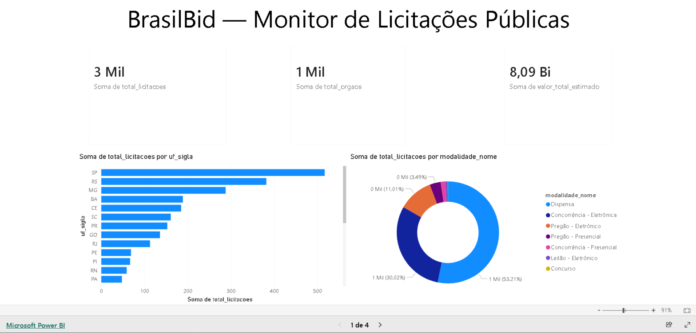
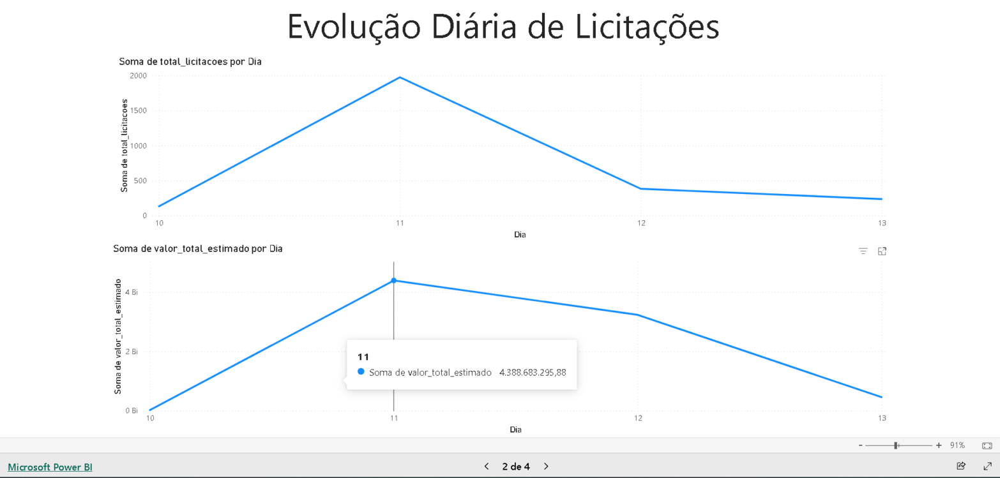
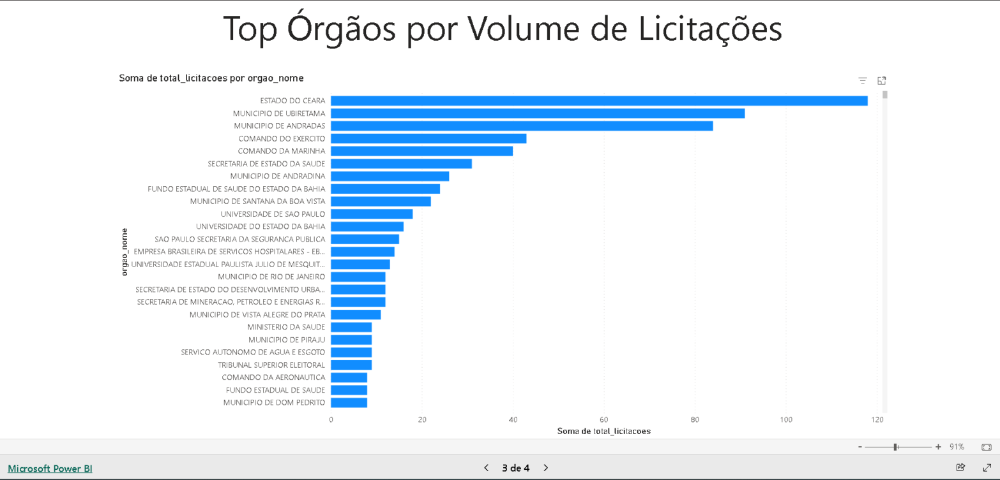
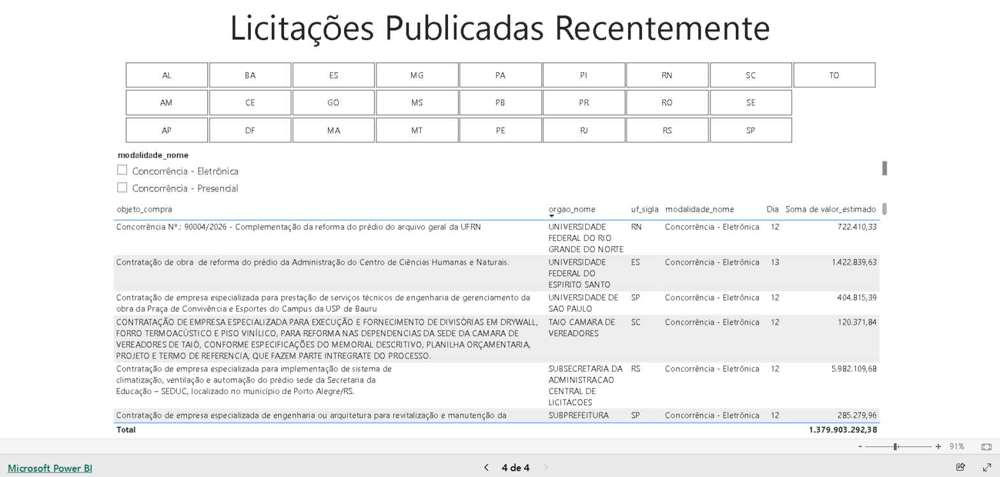

# 🏛️ BrasilBid — Monitor de Licitações Públicas

> Pipeline ETL que ingere licitações do PNCP (Portal Nacional de Contratações Públicas) via API oficial, transforma com dbt e serve dashboard ao vivo via Power BI. Transparência pública em dados reais.

[](https://github.com/Vortex11PTBR/brasilibid/actions/workflows/ingest.yml)
[](https://app.powerbi.com/view?r=eyJrIjoiYjQzNDdiMmMtMzczMi00MmY0LWIyZjMtMDg2NTEwNTUzZjE2IiwidCI6ImY5OTZjZmRiLTQyYWMtNGVhZC1iYzQzLThmZmY3Njc0Zjg4NiIsImMiOjR9&pageName=c90308a9d2662513e95b)


**[→ Dashboard ao vivo](https://app.powerbi.com/view?r=eyJrIjoiYjQzNDdiMmMtMzczMi00MmY0LWIyZjMtMDg2NTEwNTUzZjE2IiwidCI6ImY5OTZjZmRiLTQyYWMtNGVhZC1iYzQzLThmZmY3Njc0Zjg4NiIsImMiOjR9&pageName=c90308a9d2662513e95b)**

---

## O Problema

O governo federal publica **todas as compras públicas** no PNCP — licitações, contratos, dispensas — mas os dados ficam fragmentados em PDFs, portais lentos e sem nenhuma camada analítica. Empresas, fornecedores e cidadãos não têm como visualizar tendências, identificar oportunidades ou fiscalizar órgãos com eficiência.

**BrasilBid resolve isso com infraestrutura de dados real e atualização diária automática.**

---

## Screenshots

| Visão Geral — KPIs + Licitações por UF + Modalidades |
|:-----------------------------------------------------:|
|  |

| Evolução Diária — Volume e Valor ao longo do tempo |
|:---------------------------------------------------:|
|  |

| Ranking de Órgãos — Top 1.400+ entidades públicas |
|:-------------------------------------------------:|
|  |

| Licitações Recentes — Tabela filtrável por UF e Modalidade |
|:----------------------------------------------------------:|
|  |

---

## Arquitetura

```
PNCP API (8 modalidades)
    │
    ▼
Python ETL (ingestion/)
    │  ├─ pncp.py       # cliente API, paginação, retry com backoff exponencial
    │  ├─ db.py         # DDL SQLAlchemy + engine
    │  └─ upsert.py     # batch upsert ON CONFLICT DO UPDATE
    ▼
PostgreSQL 17 (Neon serverless)
    │  └─ licitacoes    # tabela raw, PK: numero_controle_pncp
    ▼
dbt (dbt/)
    │  ├─ staging/stg_licitacoes        # view limpa e tipada
    │  └─ mart/
    │       ├─ mart_por_uf              # por estado
    │       ├─ mart_por_modalidade      # por modalidade
    │       ├─ mart_por_orgao           # ranking de órgãos
    │       ├─ mart_por_municipio       # por município
    │       ├─ mart_timeline            # série diária
    │       ├─ mart_recentes            # últimas 500 licitações
    │       └─ mart_oportunidades       # licitações abertas (ativas)
    ▼
Power BI Desktop → Publish to Web (embed público)
    ▼
GitHub Actions (cron diário 05:00 BRT)
    ETL → dbt run → dbt test
```

---

## Números Reais

| Métrica | Valor |
|--------|-------|
| Total licitações | 2.700+ |
| Valor total estimado | R$ 8 Bi+ |
| Estados cobertos | 27 UFs |
| Órgãos públicos | 1.400+ |
| Atualização | Diária (automática via CI) |
| Testes de qualidade | dbt test a cada execução |

---

## Stack

| Camada | Tecnologia | Decisão |
|--------|-----------|---------|
| Ingestão | Python 3.12 · requests · SQLAlchemy | upsert idempotente, retry com backoff exponencial |
| Warehouse | PostgreSQL 17 — Neon serverless | custo zero, índices em UF, modalidade e data |
| Transformação | dbt-postgres 1.10 — staging → mart | SQL versionado, testável, documentado e auditável |
| Qualidade | dbt test — not_null, unique, accepted_values | validação automática a cada run |
| Orquestração | GitHub Actions (cron diário) | pipeline completo: ETL → dbt run → dbt test |
| Visualização | Power BI — Publish to Web | padrão corporativo BR, embed público gratuito |

---

## Fonte de Dados

**PNCP — Portal Nacional de Contratações Públicas** (`api.compras.gov.br`), API oficial do governo federal brasileiro.

| Código | Modalidade |
|--------|-----------|
| 1 | Leilão |
| 2 | Diálogo Competitivo |
| 3 | Concurso |
| 4 | Concorrência |
| 5 | Pregão |
| 6 | Manifestação de Interesse |
| 7 | Pré-qualificação |
| 8 | Credenciamento |

---

## Como Executar

```bash
git clone https://github.com/Vortex11PTBR/brasilibid
cd brasilibid
python -m venv .venv && .venv\Scripts\activate  # Windows
pip install -r requirements.txt
cp .env.example .env  # adicionar DATABASE_URL

# Ingestão
python run_ingestion.py --days 7

# dbt
cd dbt
dbt debug --profiles-dir .
dbt run --profiles-dir .
dbt test --profiles-dir .
```

---

## Estrutura

```
brasilibid/
├── ingestion/
│   ├── db.py               # schema + engine PostgreSQL
│   ├── pncp.py             # cliente PNCP API com retry e logging
│   └── upsert.py           # batch upsert idempotente
├── dbt/
│   ├── dbt_project.yml
│   └── models/
│       ├── schema.yml      # testes de qualidade de dados
│       ├── staging/
│       │   └── stg_licitacoes.sql
│       └── mart/
│           ├── mart_por_uf.sql
│           ├── mart_por_modalidade.sql
│           ├── mart_por_orgao.sql
│           ├── mart_por_municipio.sql
│           ├── mart_timeline.sql
│           ├── mart_recentes.sql
│           └── mart_oportunidades.sql
├── scripts/
│   └── gen_profiles.py     # gera dbt/profiles.yml a partir de DATABASE_URL
├── screenshots/
├── .github/workflows/ingest.yml
├── run_ingestion.py
└── requirements.txt
```

---

Desenvolvido por [João Lacerda](https://joaolacerda.dev) · Dados: PNCP / Portal Nacional de Contratações Públicas
